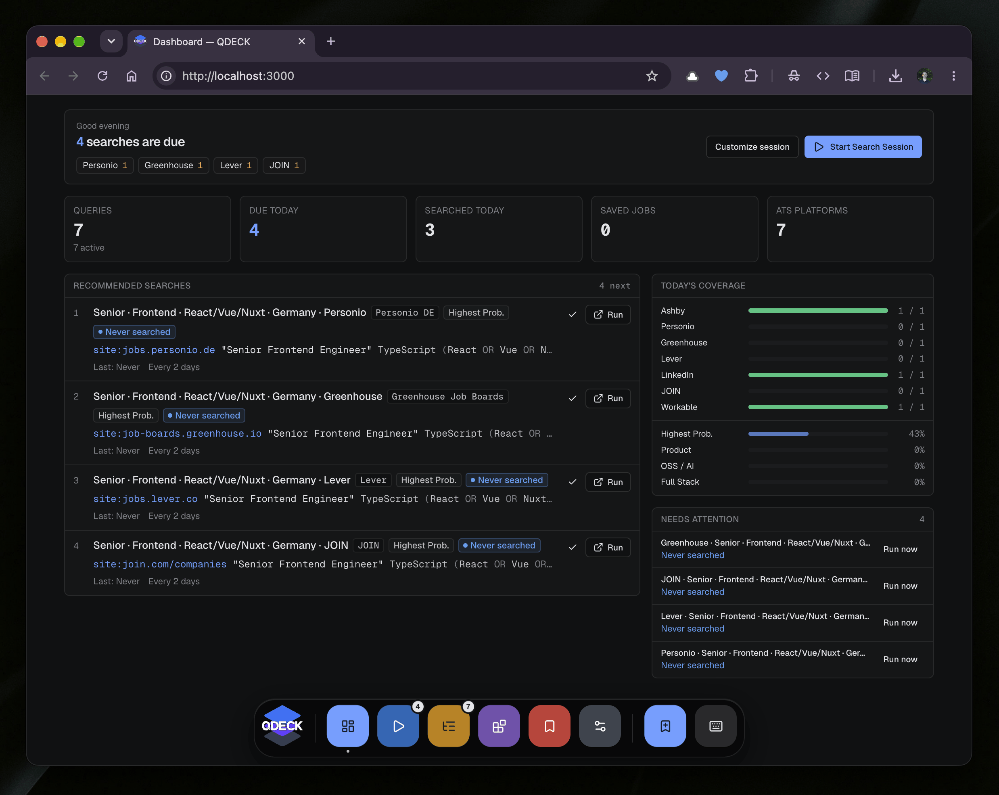

# QDECK



QDECK helps you organize a job search. Build targeted Google queries for job boards, revisit searches on a schedule, and keep track of jobs you find.

## Examples

- Build a query such as `site:jobs.ashbyhq.com "Frontend Engineer" React Berlin` and open it in Google.
- Work through due searches in a session, marking each one done or skipping it.
- Save a job and track its status from interesting to applied.

QDECK stores your data only in your browser. Use **Settings → Export data** to download a backup regularly, especially before clearing browser data or switching devices.

## Run locally

Requires Node.js 22.12+ and npm.

```sh
npm ci
npm run dev
```

Open the URL printed in the terminal. For a production run, use `npm run build` followed by `npm start`.

## Run with Docker

```sh
docker build -t qdeck .
docker run --rm -p 3000:3000 qdeck
```

Open <http://localhost:3000>. No volume is needed because app data is stored in the browser.

## Contributing

Issues and pull requests are welcome.

## License

[MIT](./LICENSE)
